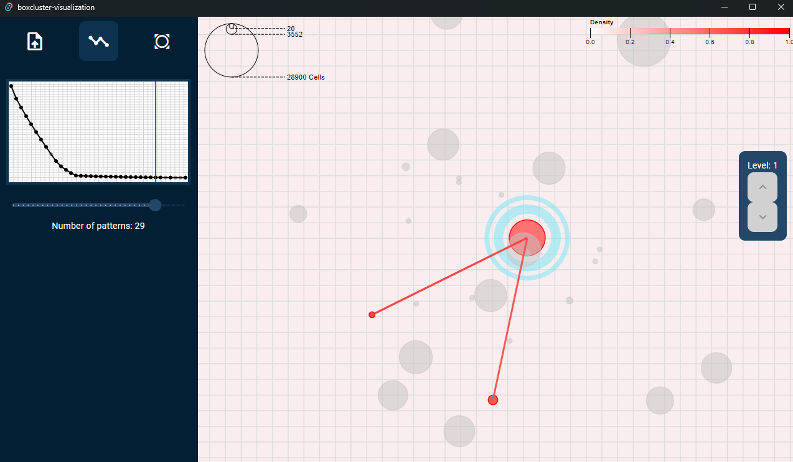
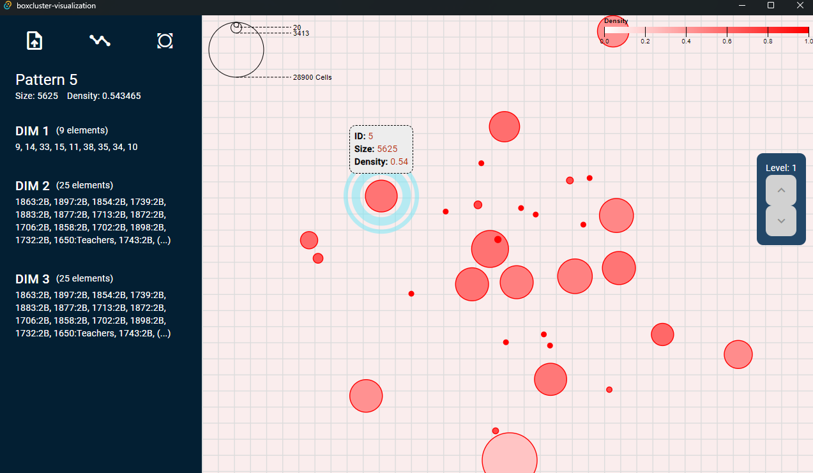

# BoxCluster Visualization

This application provides an interactive visualization tool for exploring patterns discovered by the NclusterBox algorithm in Boolean and fuzzy tensors. 

## About NclusterBox

NclusterBox is an algorithm that summarizes n-way Boolean and fuzzy tensors using sub-tensors, represented as patterns. It identifies significant patterns within the data based on their density and area, providing insights into the underlying structure and relationships within the tensor.

## Application Features

- **Interactive Scatter Plot:** Visualize patterns as data points in a 2D scatter plot. 
    - Size of data points represents the pattern size.
    - Color of data points represents the pattern density.
    - Zoom and pan to explore different regions of the visualization.
    - Tooltips display detailed information about each pattern.
    - Highlight data points and their connections to visualize intersections between patterns.
- **RSS Evolution Graph:** Analyze the Residual Sum of Squares (RSS) evolution of the model as the number of patterns increases.
    - Identify potential elbows in the graph to determine an optimal number of patterns for summarizing the tensor.
    - Truncate the model by selecting a specific number of patterns.
- **Pattern Summary View:** Explore detailed information about individual patterns.
    - View the dimensions, density, and size of the pattern.
    - Inspect the specific values of each dimension.

## Installation

Download the appropriate installation files for your operating system from the [Releases page](https://github.com/VictorHenrique317/boxcluster-visualization/releases).

## Usage

1. Launch the application.
2. Select the tensor and patterns files generated by the NclusterBox algorithm.
3. Explore the visualization, RSS evolution graph, and pattern summary view to analyze the discovered patterns.

## Technologies Used

- **Frontend:** Angular
- **Backend:** Rust
- **Visualization Library:** D3.js
- **Desktop Application Framework:** Tauri